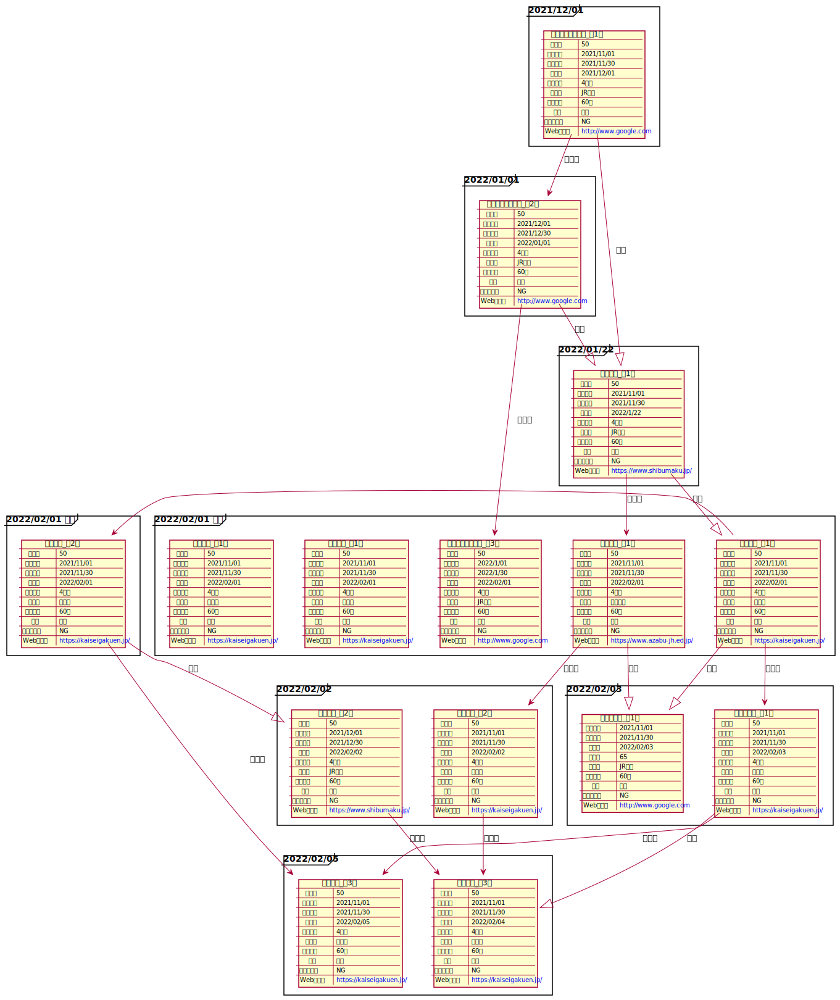

# 中学受験フローチャート

## フローチャート

## 当repoの使い方

- repoをforkする
- github pageの設定をする

### 自分チャートの使い方

- main.puml を参考に作る。

### frame

- 日付毎に作ると使いやすいかと思います。

### チャート

- `--|>` で白矢印になる為、これでリンクを作る

### 学校ファイルの使い方

- `include`を使って学校毎の定義ファイルを参照します

### 参考URL

- [https://plantuml.com/ja/](https://plantuml.com/ja/)

## ご協力のお願い

- `school` ディレクトリに学校毎にファイルを作っているので足りない学校があれば追加してPR頂けると助かります。
-